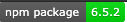

# My Project Name: README.md File Generator

## Project Description
Create README files using node.js

## Table of Content
* [Installation](#installation) 
* [Usage](#Usage)
* [License](#License)
* [Contributing](#Contributing)
* [Tests](#Tests)
* [Questions](#Questions)
    
## Installation
Just download the index.js file, install npm and inquirer package

## Usage
To generate README files using node.js

## Lincense
* Inquirer 5.6.2

## Contributing
Just reach out, I would like your feedback

## Tests
Please ensure to answer all the questions

## Questions
For any questions, please reach out to me:
    Find me in GitHub: CivicaJR91 | [My GitHub Profile](https://github.com/CivicaJR91) | [Email Me](jsuarerzrosado@gmail.com)
